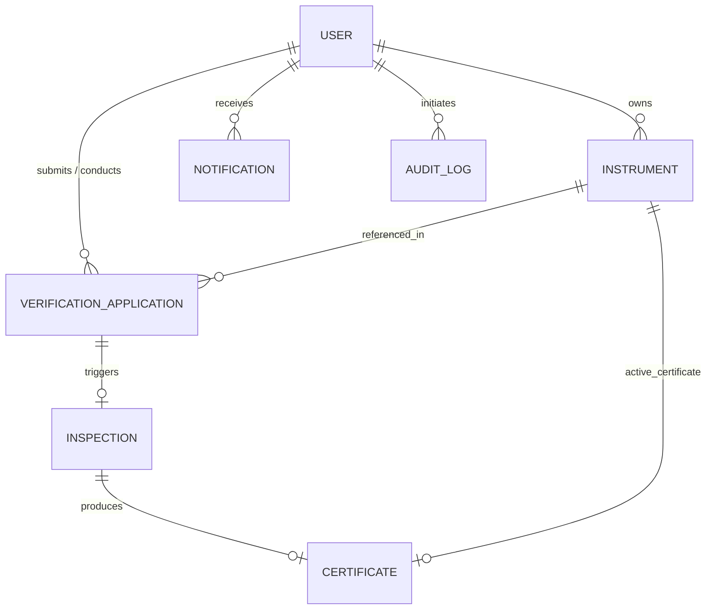

# 🏛️ MetraVerify System Architecture

## 1. Architectural Overview

MetraVerify is designed as a secure, role-driven, multi-tier web platform tailored for the digital lifecycle management of weighing and measuring instruments under Legal Metrology standards.

```
+-----------------------------------------------------------------+
|                    Client Layer (React 18 SPA)                  |
|  - React Router v6 (Protected, Role-Guarded Routes)             |
|  - Tailwind CSS (Government-grade design system)                |
|  - Lucide React & Recharts Analytics                            |
|  - Axios HTTP Interceptors (JWT Bearer Injection & Auto 401s)   |
+--------------------------------┬--------------------------------+
                                 │
                                 │ HTTP / JSON REST
                                 ▼
+-----------------------------------------------------------------+
|                    API Gateway & Middleware Layer               |
|  - Express.js v4 + Node.js ESM                                  |
|  - CORS & Morgan HTTP Logger                                    |
|  - JWT Authentication Middleware (`protect`)                    |
|  - RBAC Middleware (`authorizeRoles`)                           |
|  - Multer File Upload Filter & Sanitizer                        |
|  - Centralized Error Handling Middleware                        |
+--------------------------------┬--------------------------------+
                                 │
                 +---------------+---------------+
                 │                               │
                 ▼                               ▼
+--------------------------------+ +--------------------------------+
|         Business Services      | |       Output Services          |
|  - 7-Point Inspection Engine   | |  - QRCode Generator            |
|  - Real-time Expiry Calculator | |  - PDFKit Certificate Builder  |
|  - Tamper-Evident Audit Logger | |  - In-App Notification Dispatch|
+--------------------------------+ +--------------------------------+
                 │                               │
                 +---------------+---------------+
                                 │
                                 ▼
+-----------------------------------------------------------------+
|                      Persistence Layer                          |
|  - MongoDB NoSQL Database                                       |
|  - Mongoose Schemas with Compound Indexes                       |
|  - Collections: Users, Instruments, Applications,               |
|    Inspections, Certificates, Notifications, AuditLogs, GATCs   |
+-----------------------------------------------------------------+
```

---

## 2. Core Subsystems

### A. Authentication & Role-Based Access Control (RBAC)
- **Token Model**: Stateless JSON Web Tokens (JWT) signed with HMAC-SHA256, containing `userId` and token expiry.
- **Password Security**: Passwords hashed with `bcryptjs` using a salt work factor of 10.
- **Client Route Guards**:
  - `PublicLayout`: Unauthenticated public landing, verification, login, register, and about pages.
  - `DashboardLayout`: Gated by user role (`allowedRoles`). Unauthorized attempts trigger immediate redirect to the user's primary portal.

### B. 7-Point Statutory Inspection Engine
The digital inspection engine enforces the 7 mandatory legal checks:
1. `instrumentCondition`: Visual and mechanical mounting stability.
2. `display`: Digital segment display, backlight, and decimal readability.
3. `zeroError`: Return to gross zero after load removal within ±0.25e.
4. `accuracy`: Corner loading eccentricity test with certified standard weights.
5. `calibration`: Full-range repeatability and hysteresis tolerance.
6. `sealingStamping`: Tamper-evident lead seal or hologram application.
7. `physicalCondition`: Controlled operating environment and draft shields.

**Integrity Rule**: If any check is `PENDING` or `FAIL`, the system refuses certificate issuance and marks the case as `REJECTED` with statutory remarks.

### C. Digital Certificate & QR Code Service
- When an instrument passes all 7 checks, a `Certificate` document is created with a unique sequence number (`CERT-YYYY-XXXXXX`).
- A tamper-evident cryptographic QR code is generated using `qrcode`.
- The QR embeds only the clean URL:
  `http://<domain>/verify/<certificateNumber>`
  *(No private business data or PII is leaked in the QR payload).*
- High-fidelity PDF certificates are rendered in-flight using `pdfkit` without saving intermediate files to disk, streaming directly into the HTTP response.

### D. Real-Time Expiry Engine
- **Active Validity Rule**:
  - Days Remaining > 30: **VALID** (Green)
  - Days Remaining ≤ 30 and ≥ 0: **EXPIRING_SOON** (Amber)
  - Days Remaining < 0: **EXPIRED** (Red)
  - Revocation Flagged: **REVOKED** (Black/Struck)

---

## 3. Data Schema & Relationships



---

## 4. Security & Audit Architecture
1. **Zero Secret Leakage**: Database credentials, ports, and JWT keys are strictly externalized via `.env`.
2. **Audit Logging**: Every sensitive mutation (`USER_REGISTERED`, `INSTRUMENT_CREATED`, `APPLICATION_SUBMITTED`, `APPLICATION_ASSIGNED`, `INSPECTION_STARTED`, `CERTIFICATE_ISSUED`, `CERTIFICATE_REVOKED`) is permanently recorded in the `AuditLog` collection with actor metadata, timestamp, entity references, and IP address.
3. **Public Gateway Isolation**: Public verification queries (`/api/public/verify/:id`) project only non-sensitive metrological data, stripping internal user IDs, hashes, and private documents.
